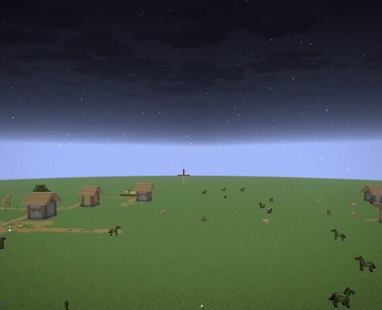

# HeadFirework (Paper版) 使用説明書



火薬・染料・プレイヤーヘッドから専用の花火の星を作り、打ち上げると爆発の瞬間にそのプレイヤーの顔が浮かび上がる演出を追加するPaperプラグインです。

## 導入方法

- サーバーの`plugins`フォルダに`headfirework-paper-*.jar`を入れて再起動するだけです
- **プレイヤー側(クライアント)への導入は不要**です。バニラクライアントのままで見た目・演出が反映されます
- 対応バージョン: Minecraft 26.2 / 26.3(26.3はPaperMCの正式ビルド公開待ちのため実機未確認) / Paper

## 表示言語について(日本語/English)

コマンドの応答・GUI(`/headfirework gui`、`/headfirework mygui`)・起動時の更新通知は、プレイヤーのMinecraftクライアントの言語設定に応じて自動的に日本語/英語が切り替わります。手動で切り替えるコマンドはありません。

- 日本語クライアント → 日本語表示、それ以外(英語を含む)のクライアント → 英語表示
- クラフトして作った花火の星・ロケットのアイテム名だけは例外で、**クラフトした本人のクライアント言語**で名前が決まります(アイテムの性質上、見る人ごとに切り替えることができないため)。あとから別の言語設定の人がそのアイテムを見ても、クラフトした人の言語のまま表示されます
- 言語を切り替えた場合、GUIはすでに開いている画面には反映されません。一度閉じてコマンドを実行し直してください

## クラフト方法

### 1. 専用の花火の星を作る

クラフト台に以下を置きます。

| 材料 | 個数 | 役割 |
|---|---|---|
| 火薬 | 1個 | 必須 |
| 染料 | 1個以上(複数色可) | 爆発の色。複数色置くと多色の花火になります |
| プレイヤーヘッド(所有者情報付き) | 1個以上(同じプレイヤーのみ) | 誰の顔が表示されるかを決めます。**消費されません**(クラフト後もそのまま手元に残ります) |

さらに、以下のいずれか1個を追加すると爆発の形状を変えられます(省略すると小玉になります)。

| 追加材料 | 形状 |
|---|---|
| (なし) | 小玉 |
| ファイヤーチャージ | 大玉 |
| 羽根 | 星形 |
| 金塊 | バースト |

演出用の追加材料(任意、各0〜1個):

- ダイヤモンド1個 → キラキラ演出
- 蓄光石(グロウストーンダスト)1個 → トレイル(尾)演出

異なるプレイヤーの頭を同時に置いた場合や、対応外のアイテムが混ざっている場合は成立しません。

### 2. ロケットに仕立てる

クラフト台に以下を置きます。

| 材料 | 個数 |
|---|---|
| 作った星 | 1個以上(複数プレイヤー分の星を混ぜてもOK) |
| 紙 | 星と同じ個数 |
| 火薬 | 1〜3個(個数で飛翔時間が変わります) |

星N個から、ロケットが**3×N個**できます。複数プレイヤーの星をまとめて入れると、1回の打ち上げで複数人の顔を同時に表示できます。

## 打ち上げ後の演出

ロケットを打ち上げて爆発すると、関わったプレイヤーの顔が爆発地点にその場に出現します。

- 小さい状態から目標サイズまで拡大 → そのまま維持 → 縮小しながらフェードアウト、という流れで約3秒間表示されます(デフォルト値。設定変更可)
- 複数人分の顔がある場合は、横に並んで表示されます
- 顔の正面が向く方角(北/東/南/西)は設定で変更できます

## 自分の花火の顔の向きを設定する(参加者向け)

管理者でなくても、自分が作った花火に映る自分の顔の向きを個別に設定できます。

```
/headfirework myface <north|south|east|west>  … 自分の花火の顔の向きを設定
/headfirework myface show                     … 現在の自分の設定を確認
/headfirework myface reset                    … 個人設定を削除し、サーバーの既定値に戻す
/headfirework mygui                           … 同じ設定をGUI(チェスト画面)で行う
```

- 誰でも使えます(管理者権限は不要です)
- 設定すると、**自分の頭を使って作った花火が爆発したとき**、誰が打ち上げたかに関わらず、自分が設定した方向で顔が表示されます(見る側が何か設定する必要はありません)
- 反映されるのは「爆発した瞬間の、その時点でのあなたの設定」です。以前と違う設定に変えてから打ち上げれば、以前作ってストックしてあった花火でも新しい設定の向きになります
- 複数人の星を1本のロケットにまとめて同時に打ち上げた場合も、それぞれの顔がそれぞれの持ち主の設定通りの向きで表示されます(顔を並べる位置自体はサーバーの既定の向きを基準に揃えられます)
- 個人設定をしていない場合は、サーバー全体の既定値(下記の管理者設定)がそのまま使われます

## 設定変更(サーバー管理者向け)

サーバー全体のデフォルト設定の変更には`headfirework.admin`権限(デフォルトではオペレーター)が必要です。

### コマンドで変更する

```
/headfirework config scale <形状> <値>          … 表示サイズ(形状: small_ball, large_ball, star, creeper, burst)
/headfirework config display_duration <tick数>  … 表示時間の合計
/headfirework config animation_duration <tick数> … 拡大にかける時間
/headfirework config fade_duration <tick数>     … フェードアウトにかける時間
/headfirework config facing <north|south|east|west> … 顔が向く方角
/headfirework config update_check <on|off>      … 起動時の更新チェックの有効/無効(デフォルト: on)
/headfirework config show                       … 現在の設定値を一覧表示
```

値を省略すると、その項目だけデフォルト値に戻せます(例: `/headfirework config scale large_ball`)。20tick=1秒です。

### GUIで変更する

```
/headfirework gui
```

チェストGUIが開き、各項目を−/+ボタンで調整できます。項目ごとに個別のリセットボタンがあり、顔の向きはコンパスアイテムのクリックで循環切り替えができます。**拡大アニメーション時間(animation_duration)と更新チェック(update_check)はGUIには無いため、コマンドで変更してください。**

### 起動時の更新チェック

サーバー起動時に、GitHub上のリリース一覧を自動的に確認し、Paper版(`headfirework-paper-v*`)の新しいバージョンが公開されていないかをチェックします。

- 新しいバージョンが見つかった場合、サーバーコンソールにログが表示されます
- さらに、`headfirework.admin`権限を持つプレイヤー(オペレーター)がサーバーに参加すると、チャットでも「新しいバージョンが公開されています」という通知とダウンロードリンクが表示されます(通知文はそのプレイヤーの言語設定に従います)
- チェックはサーバー起動時に1回だけ、非同期(裏側)で行われるため、サーバーの起動や動作が遅くなることはありません
- チェックが完了する前にOPが参加した場合、その回の参加時には通知は表示されません(再起動不要。次回チェック完了後の参加時から通知されます)
- 不要な場合は `/headfirework config update_check off` で無効にできます(デフォルトはon)。変更は次回のサーバー起動時から反映されます

### デバッグ用コマンド

```
/headfirework testhead <pitch> <roll> <yaw>
```

目の前に指定した角度で頭を1つ出せます(5秒で自動消滅)。通常のプレイでは使いません。

## 既知の制限

- 顔のフェードアウトは、標準機能では半透明化ができないため「縮小して消える」演出で代用しています
- マルチサーバー環境での動作確認はまだ行われていません